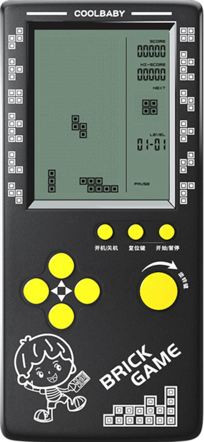
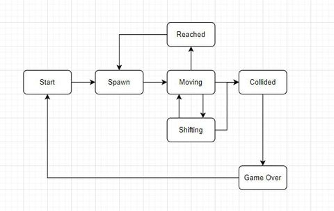
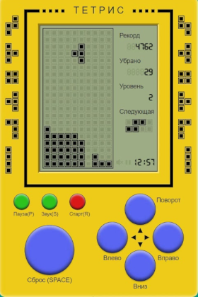
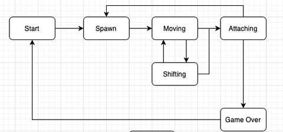
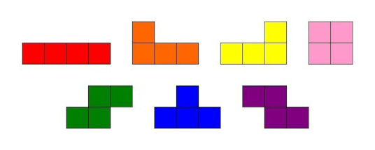

# BrickGame Тетрис

Резюме: в данном проекте представлена реализация игры «Тетрис» на языке программирования С с использованием структурного подхода.

## Содержание

- [BrickGame Тетрис](#brickgame-тетрис)
  - [Содержание](#содержание)
  - [Введение](#введение)
  - [Chapter I ](#chapter-i-)
  - [Общая информация](#общая-информация)
    - [BrickGame](#brickgame)
    - [История тетриса](#история-тетриса)
    - [Конечные автоматы](#конечные-автоматы)
    - [Фроггер](#фроггер)
    - [Тетрис](#тетрис)
  - [Chapter II ](#chapter-ii-)
  - [Описание реализации](#описание-реализации)
    - [Часть 1. Основной функционал](#часть-1-основной-функционал)
    - [Часть 2. Дополнительно. Подсчет очков и рекорд в игре](#часть-2-дополнительно-подсчет-очков-и-рекорд-в-игре)
    - [Часть 3. Дополнительно. Механика уровней](#часть-3-дополнительно-механика-уровней)

## Введение

Проект представляет собой реализацию игры «Тетрис», разделенную на две части: библиотеку, реализующую логику работы игры (может быть подключена к различным GUI), и терминальный интерфейс. Логика работы библиотеки реализована с использованием конечных автоматов.

## Chapter I 

## Общая информация
### BrickGame

BrickGame — популярная портативная консоль 90-х годов с множеством встроенных игр, разработанная в Китае. Изначально эта игра была копией «Тетриса», разработанного в СССР и выпущенного Nintendo для платформы GameBoy, но включала в себя также множество других игр, которые добавлялись с течением времени. Консоль имела небольшой экран с игровым полем размером 10 x 20, представляющим собой матрицу «пикселей». Справа от поля находилось табло с цифровой индикацией состояния текущей игры, рекордами и прочей дополнительной информацией. Самыми распространенными играми на BrickGame были: тетрис, танки, гонки, фроггер и змейка.

### История тетриса

«Тетрис» был написан Алексеем Пажитновым 6 июня 1984 года на компьютере «Электроника-60». Игра представляла собой головоломку, построенную на использовании геометрических фигур «тетрамино», состоящих из четырех квадратов. Первая коммерческая версия игры была выпущена в Америке в 1987 году. В последующие годы «Тетрис» был портирован на множество различных устройств, в том числе на мобильные телефоны, калькуляторы и карманные персональные компьютеры.

Наибольшую популярность приобрела реализация «Тетриса» для игровой консоли Game Boy и видеоприставки NES. Но кроме нее существуют различные версии игры. Например, есть версия с трехмерными фигурами или дуэльная версия, в которой два игрока получают одинаковые фигуры и пытаются обойти друг друга по очкам.

### Конечные автоматы

Конечный автомат (КА) в теории алгоритмов — математическая абстракция, модель дискретного устройства, имеющего один вход, один выход и в каждый момент времени находящегося в одном состоянии из множества возможных.

При работе КА на вход последовательно поступают входные воздействия, а на выходе КА формирует выходные сигналы. Переход из одного внутреннего состояния КА в другое может происходить не только от внешнего воздействия, но и самопроизвольно.

КА можно использовать для описания алгоритмов, позволяющих решать те или иные задачи, а также для моделирования практически любого процесса.

### Фроггер

«Фроггер» — одна из поздних игр, выходящих на консолях Brickgame. Для формализации логики этой игры был разработан следующий вариант конечного автомата:

Пример реализации фроггера с использованием КА можно найти в папке `code-samples`.

### Тетрис

«Тетрис» — одна из самых популярных игр для консоли Brickgame. Для формализации логики данной игры был разработан следующий вариант конечного автомата:

## Chapter II 

## Описание реализации

### Часть 1. Основной функционал

В рамках проекта была разработана программа BrickGame v1.0 (Tetris), обладающая следующими характеристиками:

- **Язык и стандарты**: программа написана на языке С стандарта C11, скомпилирована с использованием компилятора gcc.
- **Структура проекта**: проект разделен на две части:
  - **Библиотека** (логика игры) — располагается в директории `src/brick_game/tetris`. Библиотека реализует всю игровую механику.
  - **Терминальный интерфейс** — располагается в директории `src/gui/cli`, реализован с использованием библиотеки `ncurses` для отображения игры в терминале.
- **Конечный автомат**: для формализации игровой логики был использован конечный автомат. Диаграмма, описывающая его состояния и переходы, подготовлена в отдельном файле.
- **Интерфейс библиотеки**: библиотека предоставляет функцию для обработки ввода пользователя и функцию, возвращающую матрицу, описывающую текущее состояние игрового поля при каждом его изменении.
- **Сборка проекта**: настроен Makefile с целями: all, install, uninstall, clean, dvi, dist, test, gcov_report. Установка производится в произвольный указанный каталог.
- **Стиль кода**: при написании кода использован Google Style (адаптированный для C).
- **Тестирование**: библиотека покрыта unit-тестами с использованием библиотеки `check`. Тесты проходят на ОС Darwin/Ubuntu, покрытие составляет не менее 80%.
- **Игровые механики**:
  - Вращение фигур.
  - Перемещение фигуры по горизонтали.
  - Ускорение падения фигуры (при нажатии кнопки фигура перемещается до конца вниз).
  - Отображение следующей фигуры (превью).
  - Уничтожение заполненных линий.
  - Завершение игры при достижении верхней границы игрового поля.
  - Поддержка всех типов фигур (тетрамино), изображенных на схеме ниже.
- **Управление**: реализована поддержка всех кнопок, аналогичных физической консоли BrickGame:
  - Начало игры,
  - Пауза,
  - Завершение игры,
  - Стрелка влево — движение фигуры влево,
  - Стрелка вправо — движение фигуры вправо,
  - Стрелка вниз — ускорение падения фигуры,
  - Стрелка вверх — не используется,
  - Действие (вращение фигуры).
- **Игровое поле**: размер поля соответствует оригинальной консоли — 10 «пикселей» в ширину и 20 «пикселей» в высоту.
- **Механика падения**: фигура останавливается при достижении нижней границы или столкновении с другой фигурой, после чего генерируется следующая фигура, показанная на превью.
- **Интерфейс пользователя**: поддерживается отрисовка игрового поля и дополнительной информации (счет, рекорд, уровень, следующая фигура).

Используемые фигуры:

### Часть 2. Дополнительно. Подсчет очков и рекорд в игре

В игру добавлены следующие механики:

- **Подсчет очков**: очки начисляются за уничтожение линий по следующей системе:
  - 1 линия — 100 очков;
  - 2 линии — 300 очков;
  - 3 линии — 700 очков;
  - 4 линии — 1500 очков.
- **Хранение рекорда**: максимальное количество очков сохраняется в файле между запусками программы. Рекорд обновляется во время игры, если игрок его превышает.
- **Отображение**: информация о текущем счете и рекорде выводится на боковой панели интерфейса.

### Часть 3. Дополнительно. Механика уровней

Добавлена механика уровней, влияющая на скорость игры:

- Каждые 600 очков уровень увеличивается на 1.
- Повышение уровня увеличивает скорость падения фигур.
- Максимальный уровень — 10.
- Текущий уровень отображается на боковой панели.
