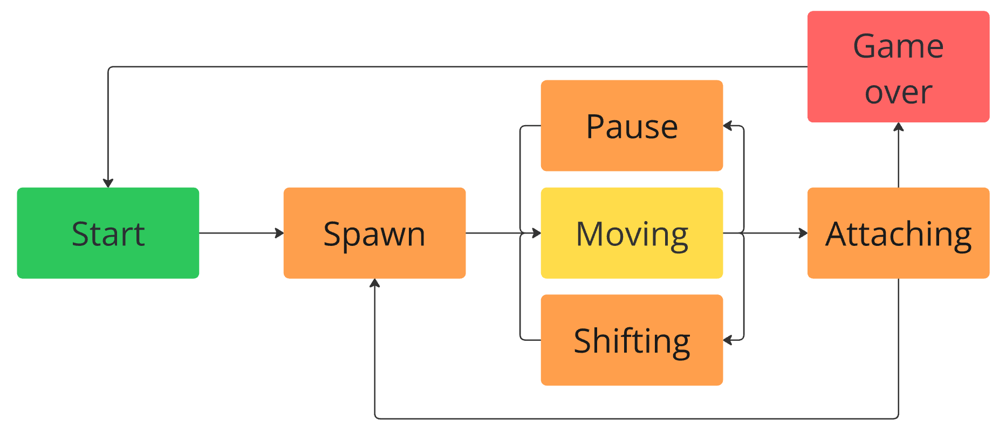

# Диаграмма состояний конечного автомата для Тетриса
Подробная расшифровка состояний к блок-схеме ниже:  

## START
Исходное состояние при запуске приложения, в котором находится пользователь, пока программа не получала от него никаких команд.  
В поле также отрисовывается leaderboard и если существует, то сколько очков было набранно в последнюю попытку.  
Разово отрисовывает поле, выводит игровое меню со следующими возможностями:
1. [space] - Начать игру
2. [q] - Закрыть программу

## SPAWN
Запуск игры.  
Запускается бесконечный цикл отрисовки поля с тикрейтом в 1 секунду для ввода клавиш.  
При переходе в это состояние, если ранее не определена `NEXT_FIGURE` спавнится случайная фигура вверху поля, определяется и отрисовывается `NEXT_FIGURE` в специальном окне справа снизу.  
Если `NEXT_FIGURE` определен, то спавнится ранее определенная фигура, а в окне справа снизу определяется следующая случайная фигура.

## MOVING
Основное игровое состояние с обработкой ввода от пользователя.  
Поворот блоков, перемещение блоков по горизонтали, ускорение падения блоков, пауза.  
В этом состоянии ожидается USER_INPUT. Возможности USER_INPUT:  
1. [p] - меню паузы  
2. [↑] - не используется в данной игре  
3. [←] - сдвиг фигуры влево  
4. [→] - сдвиг фигуры вправо  
5. [↓] - досрочное завершение таймера на сдвиг фигуры вниз  
6. [space] - поворот фигуры 

## SHIFTING
Состояние, в которое переходит игра после истечения таймера.  
В нем текущий блок перемещается вниз на один уровень.

## ATTACHING
Cостояние, в которое переходит игра после «соприкосновения» текущего блока с уже упавшими или с землей.  
Если образуются заполненные линии, то они уничтожаются, и остальные блоки смещаются вниз.  
Если блок останавливается в самом верхнем ряду, то игра переходит в состояние «игра окончена».  
 

## GAME_OVER
Игра окончена. Вылезает сообщение с набранным количеством очков, появляются возможности:
1. [space] - переход в состояние START
2. [q] - выход из игры 

## PAUSE
При нажатии на клавишу [P] игра переходит в состояние заморозки.

